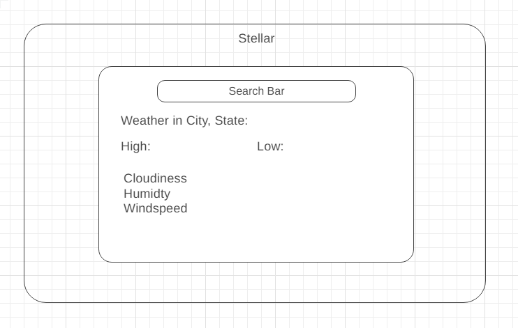

# [Stellar](https://jq-pan.github.io/Stellar/)

Stellar is an application that renders data about a particular city or town after prompting the user to enter a location. Stellar will display the city's weather conditions as well as astronomy features.

# Functionality & MVPs

- View the inputed city's weather conditions as well as a rendered view of the astronomy from the given location.

## In *Stellar*, users will be able to:

- Use a search option to look up cities. The app will fetch the city's data from an API and use it to display today's weather details including temperature, air quality data, as well as astronomy.
- Display a map that allows the user to click on a city to view the city's weather data.
- Read the data displayed on a clear table.
- View the constellations and astronomy that is relevant to the location 

## In addition, this project will include:

- An About modal describing the background and structure of the data visualization.
- This production README

# Wireframes

# Technologies, Libraries, APIs

This project is to be implemented with the following technologies:
- Weather API: https://www.weatherapi.com/.
- Mapbox API: https://www.mapbox.com/.
- Webpack to bundle and transpile the source JavaScript code.
- npm to manage project dependencies.

- Try ChartJS 
# Implementation Timeline

- Friday Afternoon & Weekend: Setup Project including all the necessary technologies including canvas, d3, and webpack
- Monday: Implement the underlying logic of Stellar to retreive data from Weather API
- Tuesday: Implement the logic behind displaying a map and allowing the user to pick a city from the map to retrieve its data.
- Wednesday: Implement the astrology features to display a city's skyscape.
- Thursday Morning: Deploy to Github pages

# Checklist

### Live Project
- [ ] Include links to portfolio website, Github, and LinkedIn
- [ ] Landing page/modal with obvious, clear instructions.
- [ ] Interactivity of some kind
- [ ] Well styled, clean frontend.
- [ ] If it has music, the option to mute or stop it
### Production README
- [ ] Link to live version
- [ ] Instructions on how to play/interact with the project
- [ ] List of technologies / libraries / APIs used.
- [ ] Technical implementation details with (good-looking) code snippets.
- [ ] To-dos / future features.
- [ ] No .DS_Store files / debuggers / console.logs.
- [ ] Organized file structure, with /src and /dist directories.