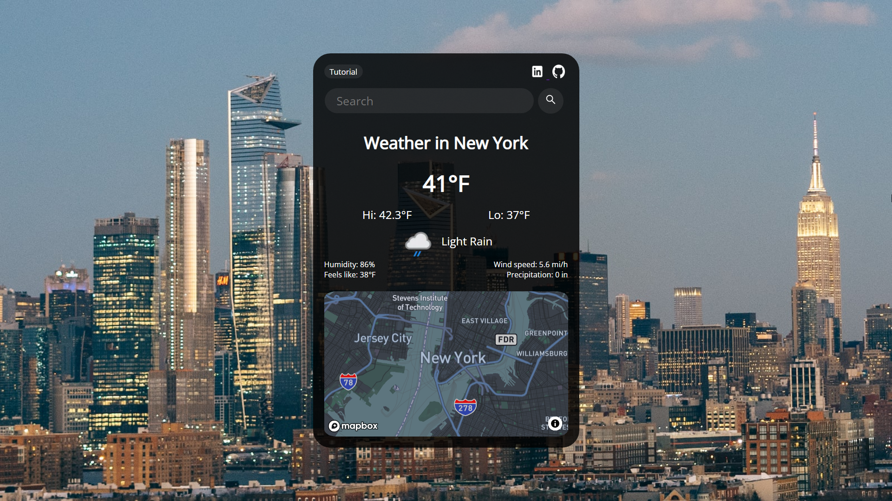
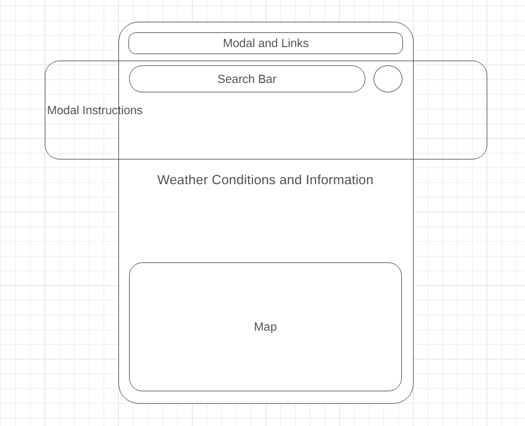

# [Stellar](https://jq-pan.github.io/Stellar/)

Stellar is an application that renders data about a particular city or town after prompting the user to enter a location. Stellar will display the city's weather conditions as well as astronomy features.



# Wireframe:



# Functionality & MVPs

## In *Stellar*, users will be able to:

- Use the search bar to input a location name. Almost all location search parameters are valid, including city and state names, country names, and zip codes. Upon submission, the corresponding data will be retrieved from Weather API, parsed, and displayed.

```js
    function renderData(data) {
        const city = document.querySelector(".city");
        const temp = document.querySelector(".temp");
        const icon = document.querySelector(".icon")
        const description = document.querySelector(".description");
        const humidity = document.querySelector(".humidity");
        const wind = document.querySelector(".wind");

        const feels = document.querySelector(".feelslike");
        const precip = document.querySelector(".precip");

        const high = document.querySelector(".high")
        const low = document.querySelector(".low")

        const long = parseFloat(data.location.lon);
        const latt = parseFloat(data.location.lat);

        getMap(long, latt);
        
        city.innerText = "Weather in " + data.location.name;
        temp.innerText = data.current.temp_f + "°F";
        icon.src = data.current.condition.icon;
        description.innerText = data.current.condition.text;
        humidity.innerText = "Humidity: " + data.current.humidity + "%";
        wind.innerText = "Wind speed: " + data.current.gust_mph + " mi/h";

        high.innerText = "Hi: " + data.forecast.forecastday[0].day.maxtemp_f + "°F";
        low.innerText = "Lo: " + data.forecast.forecastday[0].day.mintemp_f + "°F";

        feels.innerText = "Feels like: " + data.current.feelslike_f + "°F";
        precip.innerText = "Precipitation: " + data.current.precip_in + " in";

        document.querySelector(".weather").classList.remove("loading");

        const body = document.getElementsByTagName("BODY")[0];

        const searchTerm = data.location.name.split(" ").join("").toLowerCase();
        body.style.backgroundImage = "url('https://source.unsplash.com/1600x900/?" + searchTerm + "')"

    }
```

- On each refresh or search, the background will refresh and display a new image that is correlated to the name of the city/town that was searched.
- The city's weather conditions including current temperature, the day's high and low temperatures, weather condition, humidity, wind speed, percipitation, etc. will be fetched from Weather API and displayed.
```js
async function getWeatherData(userInput) {
    const options = {
        method: 'GET',
    }

    const token = ""

    const url = `http://api.weatherapi.com/v1/forecast.json?key=${token}&q=${userInput}&days=1&aqi=no&alerts=no`

    fetch(url, options)
        .then(response => {
            if (!response.ok) {
                throw new Error('Network response was not OK');
            }
            return response.json();
        })
        .then(data => {
            renderData(data);
        })
        .catch(error => {
            console.error("ERROR:", error);
        });

```
- A map of the area will be displayed by fetching data from Mapbox API.
```js
function getMap(long, latt) {
    mapboxgl.accessToken = '';

    const map = new mapboxgl.Map({
        container: 'map',
        style: 'mapbox://styles/jiongqipan/cld0k1ilh000515qffkp57mli',
        center: [-74.01, 40.71], 
        zoom: 11 
    });
    map.flyTo({
        center: [long, latt],
        essential: true
    });
}
```

## In addition, this project will include:

- An About modal describing the background and structure of the data visualization.
- This production README

# Technologies, Libraries, APIs

This project is to be implemented with the following technologies:
- Weather API: https://www.weatherapi.com/.
- Mapbox API: https://www.mapbox.com/.
- Webpack to bundle and transpile the source JavaScript code.
- npm to manage project dependencies.
- Random background images were retreived from https://source.unsplash.com/.

# Implementation Timeline

- Friday Afternoon & Weekend: Setup Project including all the necessary technologies including canvas, d3, and webpack
- Monday: Implement the underlying logic of Stellar to retreive data from Weather API
- Tuesday: Implement the logic behind displaying a map and allowing the user to pick a city from the map to retrieve its data.
- Wednesday: Complete all styling sheets and modal.
- Thursday Morning: Deploy to Github pages

# Future Implementation

- Add more details to be displayed for the weather
- Add functionality to the map to display data by clicking on a location on the map instead of searching up a specific name.
- Add "Invalid search, try again" if there are no parameters that match the user input.
